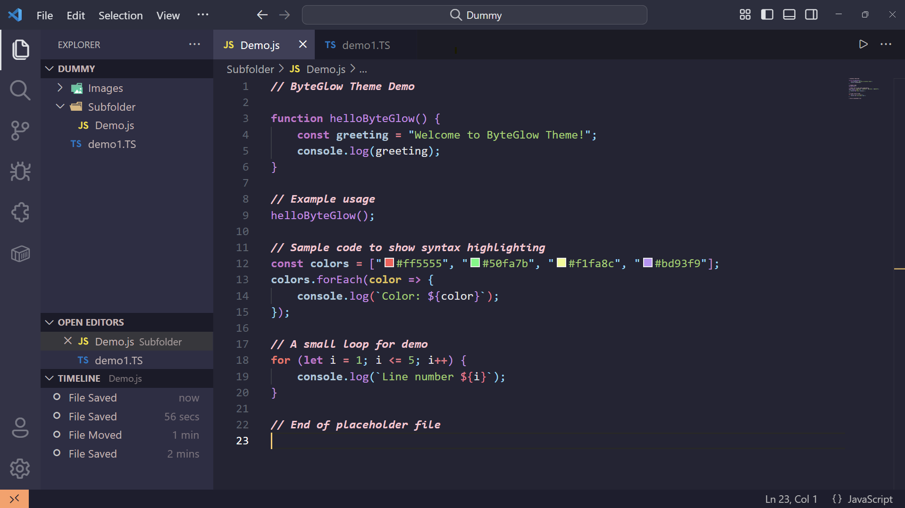
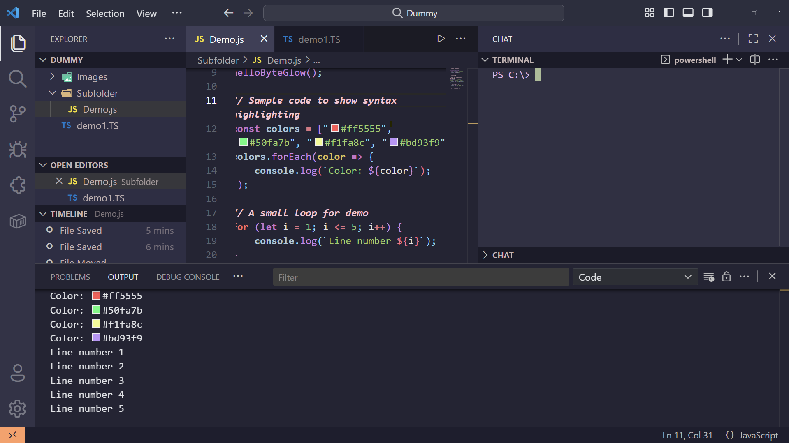

# ByteGlow Theme

A soothing theme for a modern coding experience. ByteGlow is designed to reduce eye strain while giving your code a sleek, modern look. Perfect for long coding sessions and developers who love a calm, glowing aesthetic.

---

## Features

- **Dark theme** optimized for readability
- Elegant syntax highlighting for multiple languages
- Smooth, calming colors for long coding sessions
- Works seamlessly with VS Code UI
- Fully compatible with popular VS Code extensions

---

## Screenshots

### Editor



### Terminal



_Tip: Add as many screenshots as you like. Store them in the `images/` folder and use relative paths._

---

## Installation

1. Open **VS Code**
2. Go to **Extensions** (`Ctrl+Shift+X` or `Cmd+Shift+X`)
3. Search for **ByteGlow Theme**
4. Click **Install**
5. Go to **Color Theme** (`Ctrl+K Ctrl+T`) and select **ByteGlow**

---

## Recommended Settings (Optional)

To make ByteGlow look even better, add these in your `settings.json`:

```json
"editor.fontLigatures": true,
"workbench.editor.tabSizing": "shrink",
"editor.cursorSmoothCaretAnimation": true,
"workbench.colorCustomizations": {
    "editor.selectionBackground": "#44475a80"
}
```
